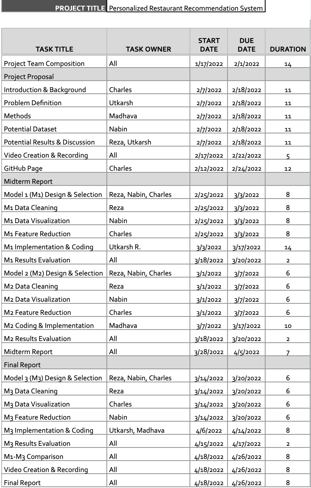
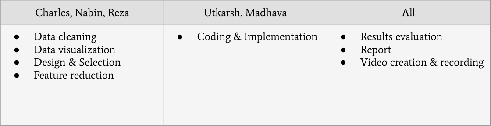

# Project Proposal Machine Learning CS 4641

[[Proposal Video]](https://www.youtube.com/watch?v=yKE7-i9g_zU)

## Introduction/Background

 In the city there are countless restaurants to choose from with more options than a person wants to consider whenever they grab lunch. Restaurant recommendation system to recommend people nearby restaurants that meet their needs and preferences. Our system will take several factors into consideration to make these recommendations. These factors include location, price, hours of service, reviews, diversity of food, revenue, weather, etc. 

#### Literature Review (COME BACK)

## Problem definition

 People usually have a hard time deciding which restaurant to go for their meal. There are several factors that affect the restaurant a person desires to go for that particular day. Current methods of restaurant recommendation mostly use one or two features at maximum to make such recommendations. We are trying to build a recommendation system that takes into account more factors to give a more personalized recommendation to the individual. 

## Methods: What algorithms or methods are you going to use to solve the problems. (Note: Methods may change when you start implementing them which is fine)

<ul>
  <li>There are mainly two methods for the recommendation system - content based filtering method and collaborative filtering method (Nagarnaik et. al. ) 
For the data cleaning processes, we will implement the Principal component analysis. To analyze the data, the light FM package that implements both the combination of collaborative filtering method and content based filtering method will be used.</li>
<li>Data such as Location, average price of the items at the restaurant, Hours of service, categories of food they serve, reviews from users and critiques, diversity of food items, Revenue of the restaurant and the statistics such as mean median scores.</li>
<li>A study shows that the attributes of a person’s preferences, a restaurant’s popularity, and restaurant price were able to strongly predict how consumers predict restaurants, and that a consumer’s preferences can be predicted by their and similar consumers’ past behaviors (Nilashi et. al.).</li>

  
</ul>

## Potential results and Discussion 

 The system will predict the ratings of the consumers based on the users’ choice of several factors. Then, the system will also return the ranked list. 

## Project member's responsibility

## Proposed timeline

## References 

<ul>
<li>Varatharajan, N., Guruprasad, J., & Mathumitha, K. (2020). Restaurant Recommendation System Using Machine Learning. International Educational Applied Research Journal, 4(3), 1-4.
Restaurant recommendation system - cs229.stanford.edu. (n.d.). Retrieved February 17, 2022, from https://cs229.stanford.edu/proj2014/Ashish%20Gandhe,Restaurant%20Recommendation%20System.pdf</li>
 
<li>Nilashi, Ahmadi, H., Arji, G., Alsalem, K. O., Samad, S., Ghabban, F., Alzahrani, A. O., Ahani, A., & Alarood, A. A. (2021). Big social data and customer decision making in vegetarian restaurants: A combined machine learning method. Journal of Retailing and Consumer Services, 62, 102630. https://doi.org/10.1016/j.jretconser.2021.102630</li>
<li>Location Based Personalized restaurant recommendation system for Mobile Environments. IEEE Xplore. (n.d.). Retrieved February 17, 2022, from https://ieeexplore.ieee.org/stamp/stamp.jsp?tp=&arnumber=6637223 
P. Nagarnaik and A. Thomas, "Survey on recommendation system methods," 2015 2nd International Conference on Electronics and Communication Systems (ICECS), 2015, pp. 1603-1608, doi: 10.1109/ECS.2015.7124857.</li>
</ul>

