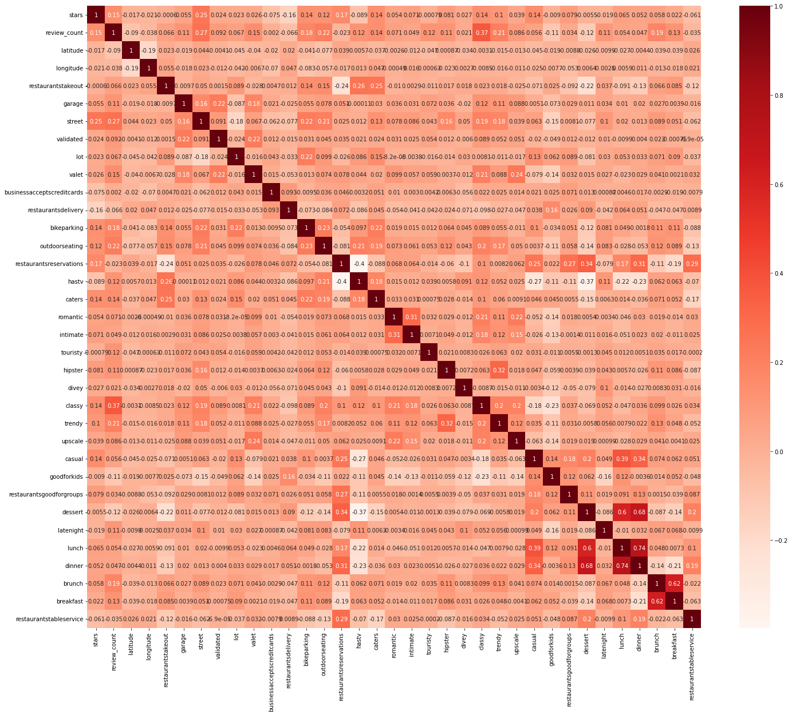
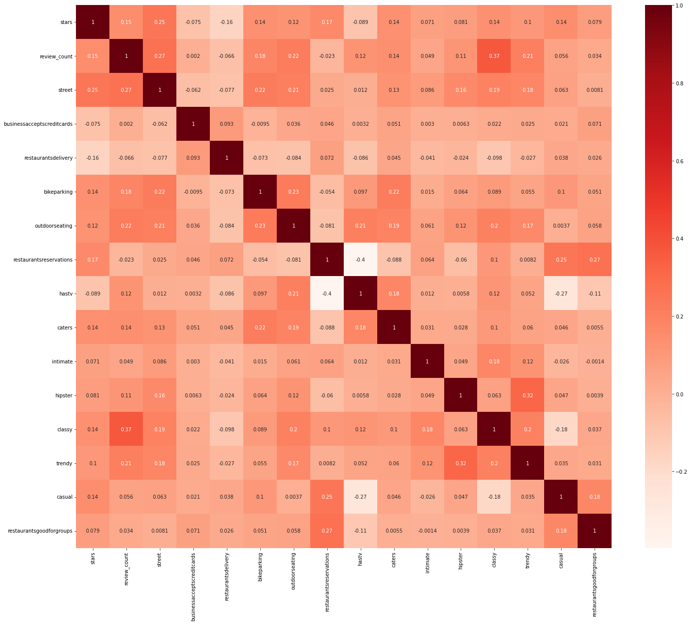
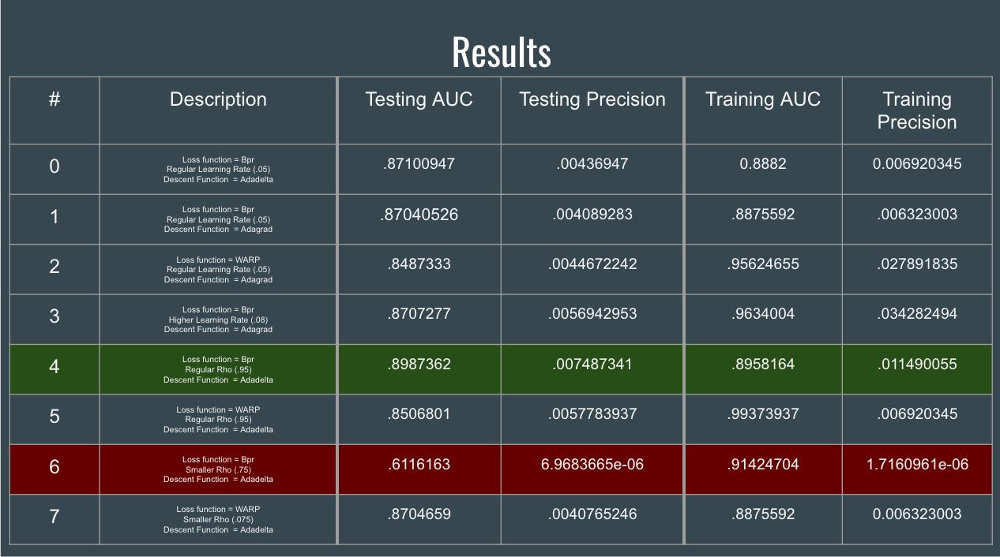
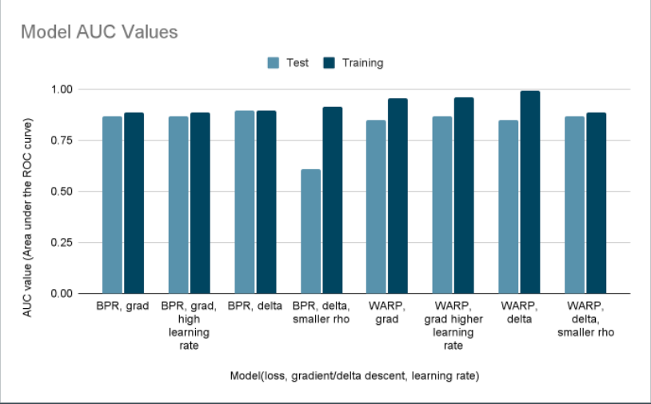

 # Project Proposal Machine Learning CS 4641

## Respective Video Links 

[[Proposal Video]](https://www.youtube.com/watch?v=yKE7-i9g_zU)

[[Final Presentation Video]](https://www.youtube.com/watch?app=desktop&v=w-PhnY4T11I)

## Introduction/Background

 In the city there are countless restaurants to choose from with more options than a person wants to consider whenever they grab lunch. Restaurant recommendation system to recommend people nearby restaurants that meet their needs and preferences. Our system will take several factors into consideration to make these recommendations. These factors include location, price, hours of service, reviews, diversity of food, revenue, weather, etc. 

### Literature Review

 In preparation for building the recommendation system, a number of preexisting  literature was consulted.

 The literature suggests that while context aware restaurant recommenders exists, most of them predominately look for location information (Varatharajan et al, 2020) This shows an opening for recommenders that look at a variety of factors. Additional research revealed that in the vegetarian food industry the factors of value, food , service, and atmosphere are strong indicators that a customer would be satisfied at restaurant (Lu & Gursoy, 2017). This information reveals key categories of factors that a restaurant recommendation system could target. Further, there has been research into designing an phone application for a content based recommendation that changes to user behavior (Gupta & Kuldeep, 2013). This design can provide an initial intuition on approaching the design of a restaurant recommendation, particularly how to handle the model specializing to each user.

## Problem definition

 People usually have a hard time deciding which restaurant to go for their meal. There are several factors that affect the restaurant a person desires to go for that particular day. Current methods of restaurant recommendation mostly use one or two features at maximum to make such recommendations. We are trying to build a recommendation system that takes into account more factors to give a more personalized recommendation to the individual. 

## Methods: 
<ul>
  <li>There are mainly two methods for the recommendation system - content based filtering method and collaborative filtering method (Nagarnaik et. al. ) 
For the data cleaning processes, we will implement the Principal component analysis. To analyze the data, the light FM package that implements both the combination of collaborative filtering method and content based filtering method will be used.</li>
<li>Data such as Location, average price of the items at the restaurant, Hours of service, categories of food they serve, reviews from users and critiques, diversity of food items, Revenue of the restaurant and the statistics such as mean median scores.</li>
<li>A study shows that the attributes of a person’s preferences, a restaurant’s popularity, and restaurant price were able to strongly predict how consumers predict restaurants, and that a consumer’s preferences can be predicted by their and similar consumers’ past behaviors (Nilashi et. al.).</li>

  
</ul>

## Potential results and Discussion 

 The system will predict the ratings of the consumers based on the users’ choice of several factors. Then, the system will also return the ranked list. 

## Project member's responsibility

## Proposed timeline

## Midterm Report
Midterm Updates

Dataset:
The initial dataset that we chose for the dataset was the Restaurant Recommendation Challenge from Kaggle. While this dataset has more than 45,000 customers in total, the features of each JSON are mostly small, not directly related to the ratings, and/or have too much incomplete data. The Yelp dataset was overall more complete and had much less incomplete data. There were also many features and the majority of them proved to be relevant to our model.

Data Preprocessing:
The original JSON files were over 6 GB with largely irrelevant information. The first dataset cleaned was the Business dataset. This dataset contained attributes such as latitude, category, attributes, and etc. Restaurant dataset was created by filtering out any business that did not list themselves as “Restaurant” or “Food” and were marked as opened. Then any relevant columns such as average stars were preserved. Processing was done on the attribute column so that the most common 50% of attributes were made into their own column on the Restaurant table. This left the restaurant table as a dataset with all the features of a restaurant as the columns. However, most of these features had missing values. Then using the developer’s understanding of restaurant norms a list of default values for each feature were decided. The criteria for the default values were based on norms in the United States from what would be from an unknown restaurant. Once the default values were made the features for the restaurants were decided this dataset was ready for feature reduction. The Business dataset started at 118.9 MB and finished as Restaurant dataset at 45.6 MB. The code for cleaning this dataset can be found in CleanBusiness.ipynb.

The second dataset to be cleaned was the review dataset. This dataset was filtered so that only reviews that were about a business in the restaurant dataset were left. Then the irrelevant columns were dropped leaving only the corresponding business and user ids as well as the star ranking. This dataset began before cleaning as 5.34GB and ended as a 485.9 MB file. The code for cleaning the reviews can be found in CleanReviews.ipynb.

Feature Reduction:
We used a covariance filtering threshold method to reduce the number of features related to the restaurants. The threshold was based on the covariance of the feature and the star rating of the restaurant. We reduced the number of features from 34 (excluding the star rating) to 15 features (excluding the star rating) such as ‘latitude’ and ‘touristy'. The heat maps for both before and after feature reduction can be seen below. For the final presentation, we plan to adjust the threshold to see if different constraints lead to more accurate models. We want to explore different methods of feature reduction to see if that would have any effect on the model. The code for handling feature reduction can be found in Feature_Reduction.ipynb.

Before Feature Reduction:

After Feature Reduction:

Model Quick Overview:
For this model we used light fm. Light FM is a hybrid recommendation model using traits of both a collaborative and content based recommendation systems. This model uses supervised learning. The code for training and testing the model can be found in Recommender.ipynb

Training Model:
Before the model training, we split our interactions matrix into the training and testing set. Specifically, we used 80% of the data for training and 20% of the data for testing. After this step, we set the loss function to bpr for our model and did model fitting using the training part of interactions, item_features, and epoch of 30. Some of the other parameters for fit include sample_weight, epochs, num_threads, and verbose. For these parameters, values of None, 1, 1, False were assigned respectively. Doing the things mentioned above took care of our model training process. 

Discussion:
The metrics we are using to evaluate our model are the area under the ROC curve and the precision at k. ROC stands for receiver operating characteristic curve. This curve plots the false positive rate vs the true positive rate. We use the area under the curve (AUC) to determine the accuracy of our model. It measures the two-dimensional area under the entire curve of ROC from 0 to 1.  Our average AUC for the training model was 0.8882 and the average for the test model was 0.8710. This indicates that our model was not overfitted and it is fairly accurate. While there is potential for improvement, at this stage of development 0.8710 far exceeds random chance. The precision at k was lower than expected. For the test model the precision at k was 0.0044. After further inspection, it was most probably due to the fact that many users have not interacted with many restaurants. The LightFM package gives a 0 when there are no interactions at that point, and thus due to the scale of the datasets there were bound to be many of these cases. This may have skewed our results and it is something we are going to look into for our final presentation. 

## References 

<ul>
<li>Varatharajan, N., Guruprasad, J., & Mathumitha, K. (2020). Restaurant Recommendation System Using Machine Learning. International Educational Applied Research Journal, 4(3), 1-4.</li>
<li>Restaurant recommendation system - cs229.stanford.edu. (n.d.). Retrieved February 17, 2022, from https://cs229.stanford.edu/proj2014/Ashish%20Gandhe,Restaurant%20Recommendation%20System.pdf</li>
<li>Nilashi, Ahmadi, H., Arji, G., Alsalem, K. O., Samad, S., Ghabban, F., Alzahrani, A. O., Ahani, A., & Alarood, A. A. (2021). Big social data and customer decision making in vegetarian restaurants: A combined machine learning method. Journal of Retailing and Consumer Services, 62, 102630. https://doi.org/10.1016/j.jretconser.2021.102630</li>
<li>Location Based Personalized restaurant recommendation system for Mobile Environments. IEEE Xplore. (n.d.). Retrieved February 17, 2022, from https://ieeexplore.ieee.org/stamp/stamp.jsp?tp=&arnumber=6637223 
P. Nagarnaik and A. Thomas, "Survey on recommendation system methods," 2015 2nd International Conference on Electronics and Communication Systems (ICECS), 2015, pp. 1603-1608, doi: 10.1109/ECS.2015.7124857.</li>
</ul>

# Final Report
## Introduction / Background
In the city there are countless restaurants to choose from with more options than a person wants to consider whenever they grab lunch. Restaurant recommendation system to recommend people nearby restaurants that meet their needs and preferences. Our system will take several factors into consideration to make these recommendations. These factors include location, price, hours of service, reviews, diversity of food, revenue, weather, etc.

## Problem definition
People usually have a hard time deciding which restaurant to go for their meal. There are several factors that affect the restaurant a person desires to go for that particular day. Current methods of restaurant recommendation mostly use one or two features at maximum to make such recommendations. We are trying to build a recommendation system that takes into account more factors to give a more personalized recommendation to the individual. A study shows that the attributes of a person’s preferences, a restaurant’s popularity, and restaurant price were able to strongly predict how consumers predict restaurants, and that a consumer’s preferences can be predicted by their and similar consumers’ past behaviors (Nilashi et. al.).

## Dataset
The initial dataset that we chose for the dataset was the Restaurant Recommendation Challenge from Kaggle. While this dataset has more than 45,000 customers in total, the features of each JSON are mostly small, not directly related to the ratings, and/or have too much incomplete data. The Yelp dataset was overall more complete and had much less incomplete data. There were also many features and the majority of them proved to be relevant to our model. 

## Data Preprocessing
The original JSON files were over 6 GB with largely irrelevant information. The first dataset cleaned was the Business dataset. This dataset contained attributes such as latitude, category, attributes, and etc. Restaurant dataset was created by filtering out any business that did not list themselves as “Restaurant” or “Food” and were marked as opened. Then any relevant columns such as average stars were preserved. Processing was done on the attribute column so that the most common 50% of attributes were made into their own column on the Restaurant table. This left the restaurant table as a dataset with all the features of a restaurant as the columns. However, most of these features had missing values. Then using the developer’s understanding of restaurant norms a list of default values for each feature were decided. The criteria for the default values were based on norms in the United States from what would be from an unknown restaurant. Once the default values were made the features for the restaurants were decided this dataset was ready for feature reduction. The Business dataset started at 118.9MB and finished as Restaurant dataset at 45.6 MB.

The second dataset to be cleaned was the review dataset. This dataset was filtered so that only reviews that were about a business in the restaurant dataset were left. Then the irrelevant columns were dropped leaving only the corresponding business and user ids as well as the star ranking. This dataset began before cleaning as 5.34GB and ended as a 485.9 MB file. 

## Feature Reduction
We used a covariance filtering threshold method to reduce the number of features related to the restaurants. The threshold was based on the covariance of the feature and the star rating of the restaurant. We reduced the number of features from 34 (excluding the star rating) to 15 features (excluding the star rating) such as ‘latitude’ and ‘touristy'. The heat maps for both before and after feature reduction can be seen below. For the final presentation, we plan to adjust the threshold to see if different constraints lead to more accurate models. We want to explore different methods of feature reduction to see if that would have any effect on the model. 

Before Feature Reduction:

After Feature Reduction:

## Model Quick Overview
For this model we used light fm. Light FM is a hybrid recommendation model using traits of both a collaborative and content based recommendation systems. This model uses supervised learning. The code for training and testing the model can be found in Recommender.ipynb

## BPR vs WARP loss functions
The two loss functions we tested in this project were the Bayesian Personalized Ranking (BPR) and Weighted Approximate-Rank Pairwise (WARP) functions. BPR is a pairwise personalized ranking loss. It compares the preference of two restaurants in our case, which would be more preferred between the two. The model uses the triplet (user, positiveItem, negativeItem) where the model tries to maximize the posterior probability that the postiveItem is preferred over the negativeItem. Since the loss function compares two restaurants together, it creates a more personalized ranking system for the users. WARP is very similar to BPR however, it does not assign the negativeItem through random sampling. It chooses the negativeItem through restaurants that would violate the desired item ranking in the current state of the model. 

## Training Model
Before the model training, we split our interactions matrix into the training and testing set. Specifically, we used 80% of the data for training and 20% of the data for testing. After this step, we set the loss function to bpr for our model and did model fitting using the training part of interactions, item_features, and epoch of 30. Some of the other parameters for fit include sample_weight, epochs, num_threads, and verbose. For these parameters, values of None, 1, 1, False were assigned respectively. Doing the things mentioned above took care of our model training process. 

## Discussion
The metrics we are using to evaluate our model are the area under the ROC curve and the precision at k. ROC stands for receiver operating characteristic curve. This curve plots the false positive rate vs the true positive rate. We use the area under the curve (AUC) to determine the accuracy of our model. It measures the two-dimensional area under the entire curve of ROC from 0 to 1.  Our average AUC for the training model was 0.8882 and the average for the test model was 0.8710. This indicates that our model was not overfitted and it is fairly accurate. The precision at k was lower than expected. For the test model the precision at k was 0.0044. After further inspection, it was most probably due to the fact that many users have not interacted with many restaurants. The LightFM package gives a 0 when there are no interactions at that point. 

## Results and Discussions
Since lightfm is a deep learning method, different variations of hyperparameters were experimented on to find a model that performed the best. The model that provided the best AUC on the test results was model 4. In respect to AUC, it beat our next best model, model 0, by a difference of only around .02. This is a relatively small increase in accuracy. However, model 4 almost has double the precision as model 0 which means that model 4 can be far more reliable to restaurants that a consumer is comfortable with. Both of the two best models 0 and 4 used Bpr, but every model using WARP was not far behind. WARP notably produced a high performing model with accuracy around .85 which while being in the middle of the pack in terms of the models tested is far better than .61 AUC of the model using BPR loss function. 

Learning Rate and Rho Impact on Model
If the learning rate that is used is low, the number of iterations needed to minimize the cost function takes is high. In other words, the model takes a lot more time to complete. Whereas, if the learning rate that is used is high, the number of iterations needed will be low. This will make the model complete a lot faster. For the adadelta models, the precision increased with the increase in rho value. 

This dynamic suggests that combining the loss function with a low Rho value will likely lead to poor model performance. It also may suggest a need for caution when choosing Bpr as a loss function as while it can perform better than the WARP loss function which it was compared to, it has a potential to cause the model to perform significantly poorer. Thus, it may be prudent to develop recommendation systems to begin with training a model that uses WARP loss, but if time permits creating new alternative models that use Bpr could prove to end with more favorable results.

## Conclusion
Overall, we are satisfied with our model’s results. We were able to produce a model that yields an almost 90% accuracy. If we decided to pursue this project further, we would try to increase this accuracy by fine tuning the hyperparameters. 

## References
<ul>
<li>Varatharajan, N., Guruprasad, J., & Mathumitha, K. (2020). Restaurant Recommendation System Using Machine Learning. International Educational Applied Research Journal, 4(3), 1-4.</li>
<li>Restaurant recommendation system - cs229.stanford.edu. (n.d.). Retrieved February 17, 2022, from https://cs229.stanford.edu/proj2014/Ashish%20Gandhe,Restaurant%20Recommendation%20System.pdf</li>
<li>Nilashi, Ahmadi, H., Arji, G., Alsalem, K. O., Samad, S., Ghabban, F., Alzahrani, A. O., Ahani, A., & Alarood, A. A. (2021). Big social data and customer decision making in vegetarian restaurants: A combined machine learning method. Journal of Retailing and Consumer Services, 62, 102630. https://doi.org/10.1016/j.jretconser.2021.102630</li>
<li>Location Based Personalized restaurant recommendation system for Mobile Environments. IEEE Xplore. (n.d.). Retrieved February 17, 2022, from https://ieeexplore.ieee.org/stamp/stamp.jsp?tp=&arnumber=6637223 
P. Nagarnaik and A. Thomas, "Survey on recommendation system methods," 2015 2nd International Conference on Electronics and Communication Systems (ICECS), 2015, pp. 1603-1608, doi: 10.1109/ECS.2015.7124857.</li>
</ul>
